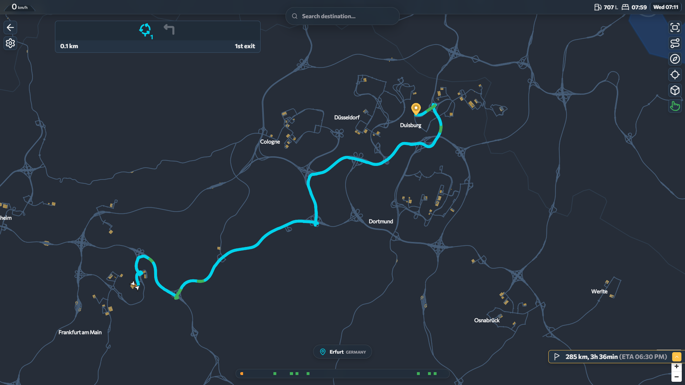

<div align="center">
  <h1>TruckNavAdvanced</h1>
  <p><strong>External GPS Navigation System for Euro Truck Simulator 2 & American Truck Simulator</strong></p>
</div>

<br />

<div align="center">
  
</div>

<br />

TruckNavAdvanced is a real-time external GPS navigation system built with TypeScript and Vue.js. It transforms any device with a web browser — phone, tablet, or secondary monitor — into a fully featured navigation display for ETS2 and ATS. The system connects to the SCS Telemetry SDK to provide live tracking, custom graph-based routing, and an immersive driving interface.

---

## Features

- **Real-Time Navigation:** Live truck tracking with automatic camera follow, smooth rotation, and pitch adjustment.
- **Custom Routing Engine:** A dedicated A\*-based pathfinding algorithm powered by a pre-compiled road network graph, with support for edge-exclusion alternative routes.
- **Alternative Routes:** The engine computes a secondary path alongside the primary route, displayed as a selectable overlay with time and distance comparison.
- **Traffic-Adjusted ETA:** Estimated time of arrival dynamically calculated using current truck speed and real-time congestion data from TruckersMP.
- **Auto Day/Night Theme:** The interface automatically switches between light and dark modes based on the in-game time of day.
- **Auto-Zoom on Turns:** Camera automatically pitches and zooms when approaching complex intersections or exits.
- **Voice Guidance:** Configurable audio alerts for overspeeding, upcoming turns, and traffic conditions.
- **Route Path Progress:** Driven segments of the route fade to grey, reducing visual clutter on complex interchanges.
- **Floating Speedometer:** A minimal speed display with an integrated speed limit badge that highlights when exceeding the limit.
- **Rerouting Detection:** Automatic deviation detection triggers route recalculation with visual feedback.
- **Traffic Progress Bar:** A bottom-of-screen indicator showing congestion levels along the active route (TruckersMP data).
- **Route Overview:** One-tap zoom to view the full remaining route, then seamless return to follow mode.
- **Glassmorphism UI:** Translucent, backdrop-blurred interface elements with smooth transitions and a modern aesthetic.

---

## Roadmap

- **Lane Guidance:** Visual lane indicators for complex intersections and highway exits.

---

## Compatibility

| Component | Status |
|-----------|--------|
| ETS2 / ATS | Supported up to version 1.59 |
| Official DLCs | All map expansions supported |
| Map Mods (ProMods, etc.) | Not currently supported |
| Platform | Web (any browser), Android (APK), Electron (desktop) |

### Known Limitations

- Routing may behave unpredictably inside custom company prefab yards; driving toward the exit typically resolves pathfinding.
- Mods that modify vanilla company names (except those by MLH82) may cause routing failures.

---

## Installation

### Option A: Standalone Executable

1. Download the latest installer from the [Releases](https://github.com/KongGithubDev/TruckNav-Sim-Advanced/releases) page.
2. Run the installer and launch the application.
3. For mobile use, install the APK or open a browser and navigate to the IP address shown in the desktop app.

### Option B: From Source

**Prerequisites:** [Node.js (LTS)](https://nodejs.org/) and [Git](https://git-scm.com/).

```bash
git clone https://github.com/KongGithubDev/TruckNav-Sim-Advanced.git
cd TruckNav-Sim-Advanced
npm install
npx nuxi dev --host 0.0.0.0
```

Access the application at `http://<your-local-ip>:3000`.

> **Windows note:** If you encounter script execution errors, run PowerShell as Administrator and execute:
> ```powershell
> Set-ExecutionPolicy -Scope Process -ExecutionPolicy Bypass
> ```

---

## Architecture

1. **Telemetry Bridge** — The application connects to the SCS SDK Telemetry server to receive real-time vehicle data (position, speed, heading, job info).
2. **Coordinate Conversion** — Game-space coordinates are transformed to WGS84 (geographic) coordinates for rendering on a MapLibre GL JS map.
3. **Custom Graph Routing** — A pre-compiled road network graph is loaded into a Web Worker, where A\* pathfinding computes optimal routes with support for DLC filtering, ferry detection, and alternative path generation.

---

## Contributing

If you encounter routing errors (illegal turns, missing roads, broken paths), please report them via [GitHub Issues](https://github.com/KongGithubDev/TruckNav-Sim-Advanced/issues).

Include a description and screenshot of the issue when possible.

---

## Acknowledgements

- [@truckermudgeon](https://github.com/truckermudgeon) — The `maps` repository provided the foundational logic for map parsing and WGS84 coordinate conversion.
- [@RenCloud](https://github.com/RenCloud) — The `scs-sdk-plugin` project made telemetry communication between the game and web environment possible.

<div align="center">
  <i>Drive safe, and happy trucking.</i>
</div>
